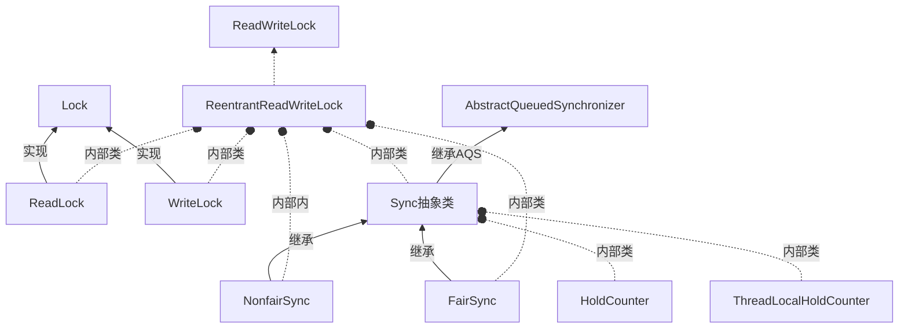

# 读写锁

读写锁实际维护了一对锁，一个读锁，一个写锁. 读使用的共享锁, 写使用的独占锁.

## 1. 读写锁的类关系



## 2. 对应的分析

### 2.1 每个类的职责

- `ReadWriteLock` 接口定义了两个方法 `readLock`, `writeLock` 获取读锁和写锁
- `ReentrantReadWriteLock` 读写锁的具体实现,内部维护了5个内部类
- `Sync` 实现了 `AQS` 的一些基本方法, 暴露两个抽象方法 `readerShouldBlock`  和 `writerShouldBlock`
- `NonfairSync` 非公平锁
- `FairSync` 公平锁
- `ReadLock` 读锁, 实现了 `Lock`接口, 在构造器上可见, 需要将外部的 `sync` 对象传入
- `WriteLock `写锁, 实现了 `Lock`接口, 在构造器上可见, 需要将外部的 `sync` 对象传入
- `HoldCounter`:  内部维护了一个 `count` 变量,记录线程重入的次数
- `ThreadLocalHoldCounter`: 继承ThreadLocal，用于记录HoldCounter

### 2.2 公平锁与非公平锁

```java
/** 公平锁 **/
// 对于公平锁而言, 无论是读还是写,都需要关心知否队列中有线程在排队,有则返回 true, 进行阻塞
static final class FairSync extends Sync {
  private static final long serialVersionUID = -2274990926593161451L;
  final boolean writerShouldBlock() {
    // 前面是否有线程在排队
    return hasQueuedPredecessors();
  }
  final boolean readerShouldBlock() {
    return hasQueuedPredecessors();
  }
}


/** 非公平锁 **/
// 对于非公平锁而言, 写永远返回false, 不参与阻塞,直接参与竞争
// 读则直接返回 apparentlyFirstQueuedIsExclusive(), 根据 判断等待队列里的头的后续结点是不是写锁节点
static final class NonfairSync extends Sync {
  private static final long serialVersionUID = -8159625535654395037L;
  final boolean writerShouldBlock() {
    return false; // writers can always barge
  }
  final boolean readerShouldBlock() {
    /* As a heuristic to avoid indefinite writer starvation,
             * block if the thread that momentarily appears to be head
             * of queue, if one exists, is a waiting writer.  This is
             * only a probabilistic effect since a new reader will not
             * block if there is a waiting writer behind other enabled
             * readers that have not yet drained from the queue.
             */
    return apparentlyFirstQueuedIsExclusive();
  }
}

/** AQS */
final boolean apparentlyFirstQueuedIsExclusive() {
  Node h, s;
  return (h = head) != null && (s = h.next)  != null &&
    !(s instanceof SharedNode) && s.waiter != null;
}
```

在 `ReentrantReadWriteLock` 怎么使用的 公平锁与公平锁 的, 使用方式由实例化的时候声明的. 默认的情况下是非公平锁

```java
public ReentrantReadWriteLock() {
  this(false);
}

/**
 * Creates a new {@code ReentrantReadWriteLock} with
 * the given fairness policy.
 *
 * @param fair {@code true} if this lock should use a fair ordering policy
 */
public ReentrantReadWriteLock(boolean fair) {
  sync = fair ? new FairSync() : new NonfairSync();
  readerLock = new ReadLock(this);
  writerLock = new WriteLock(this);
}
```

### 2.3 ReadLock&WriteLock

ReadLock与WriteLock都实现了`Lock`

#### 2.3.1 ReadLock部分代码

```java
// 不响应中断获取共享锁
public void lock() {
   sync.acquireShared(1);
}

// 响应中断获取共享锁
public void lockInterruptibly() throws InterruptedException {
  sync.acquireSharedInterruptibly(1);
}

// 调用的是父类的内部类Sync类的 tryReadLock
public boolean tryLock() {
  return sync.tryReadLock();
}

// 释放共享锁1次
public void unlock() {
  sync.releaseShared(1);
}
```

#### 2.3.2 WriteLock部分源码

```java
// 不响应中断获取独占锁
public void lock() {
  sync.acquire(1);
}

// 响应中断获取独占锁
public void lockInterruptibly() throws InterruptedException {
  sync.acquireInterruptibly(1);
}

// 调用的是父类的内部类Sync类的 tryWriteLock
public boolean tryLock() {
  return sync.tryWriteLock();
}

// 释放独占锁1次
public void unlock() {
  sync.release(1);
}
```

从中可看出, 读写和写锁最终的不同点在于, 读锁采用的是共享锁,而写锁采用的是独占锁. 另外 `tryLock` 方法, 在读锁中调用的是 `Sync` 的 `tryReadLock`, 而写锁中调用的是 `tryWriteLock`, 现在我们继续往上看看 `Sync` 这个 `AQS` 的子类中, 是怎么声明的这两个自定义方法.

### 2.4 Sync

这是 `ReentrantReadWriteLock` 的内部类, 其是一个 `AQS` 的抽象类的一个子类.

> @ReservedStackAccess 注解的作用,. 这个是JEP 270添加的新注解。它会保护被注解的方法，通过添加一些额外的空间，防止在多线程运行的时候出现栈溢出.

```java
static final int SHARED_SHIFT   = 16;
static final int SHARED_UNIT    = (1 << SHARED_SHIFT);
// 读锁或者写锁的最大获取次数
static final int MAX_COUNT      = (1 << SHARED_SHIFT) - 1;
static final int EXCLUSIVE_MASK = (1 << SHARED_SHIFT) - 1;

/** Returns the number of shared holds represented in count. */
// 高16位表示读锁
static int sharedCount(int c)    { return c >>> SHARED_SHIFT; }

/** Returns the number of exclusive holds represented in count. */
// 低16位表示写锁
static int exclusiveCount(int c) { return c & EXCLUSIVE_MASK; }

@ReservedStackAccess
final boolean tryWriteLock() {
  Thread current = Thread.currentThread();
  int c = getState();
  // 锁的数量大于0
  if (c != 0) {
    // 获取写锁计数器
    int w = exclusiveCount(c);
    // 写锁计数器为0或者不是当前线程
    if (w == 0 || current != getExclusiveOwnerThread())
      return false;
    // 锁的数量是否超标了
    if (w == MAX_COUNT)
      throw new Error("Maximum lock count exceeded");
  }
  // 走到这里的情况只可能是c==0或者获得锁的线程是当前线程
  if (!compareAndSetState(c, c + 1))
    return false;
  // 设置当前线程拥有独占访问权限
  setExclusiveOwnerThread(current);
  return true;
}


@ReservedStackAccess
final boolean tryReadLock() {
  Thread current = Thread.currentThread();
  for (;;) {
    int c = getState();
    // 有写锁并且不是自己拥有
    if (exclusiveCount(c) != 0 && getExclusiveOwnerThread() != current)
      return false;
    int r = sharedCount(c);
    if (r == MAX_COUNT)
      throw new Error("Maximum lock count exceeded");
    
    // 共享锁次数没超标
    if (compareAndSetState(c, c + SHARED_UNIT)) {
      if (r == 0) {
        // 自己是第一个,放入读锁缓存,次数赋值1
        firstReader = current;
        firstReaderHoldCount = 1;
      } else if (firstReader == current) {
        // 重入锁计数加1
        firstReaderHoldCount++;
      } else {
        HoldCounter rh = cachedHoldCounter;
        if (rh == null || rh.tid != LockSupport.getThreadId(current))
          cachedHoldCounter = rh = readHolds.get();
        else if (rh.count == 0)
          readHolds.set(rh);
        rh.count++; // 增减当前线程额计数器
      }
      return true;
    }
  }
}
```

总结出, 读与读之间不互斥, 写与写,写与读互斥.

## 3. 使用案例

```java
public class CustomCache {

    private static final Map<String, String> cache = new HashMap<>();
    private static final ReadWriteLock readWriteLock = new ReentrantReadWriteLock(false);
    private static final Lock readLock = readWriteLock.readLock();
    private static final Lock writeLock = readWriteLock.writeLock();

    /**
     * 读取缓存值
     *
     * @param key 缓存key
     * @return 缓存值
     */
    public static String get(String key) {
        readLock.lock();
        try {
            System.out.println(Thread.currentThread().getName() + ": 开始读取值");
            String s = cache.get(key);
            System.out.println(Thread.currentThread().getName() + ": 结束读取值");
            return s;
        } finally {
            readLock.unlock();
        }
    }

    /**
     * 写入缓存值
     *
     * @param key   缓存key
     * @param value 缓存值
     */
    public static void put(String key, String value) {
        writeLock.lock();
        try {
            System.out.println(Thread.currentThread().getName() + ": 开始写入值");
            cache.put(key, value);
            System.out.println(Thread.currentThread().getName() + ": 结束写入值");
        } finally {
            writeLock.unlock();
        }
    }

    public static void main(String[] args) {
        ThreadPoolExecutor executor = new ThreadPoolExecutor(10, 10, 3,
                TimeUnit.SECONDS, new ArrayBlockingQueue<>(10), Executors.defaultThreadFactory(),
                new ThreadPoolExecutor.AbortPolicy());
        int size = 3;
        for (int i = 0; i < size; i++) {
            final int tmp = i;
            executor.execute(() -> {
                put("key", "name" + tmp);
            });
        }

        for (int i = 0; i < size; i++) {
            executor.execute(() -> {
                get("key");
            });
        }
    }
}
```

多个线程同时进入读取状态, 但是只有写的时候, 必须等待写完比