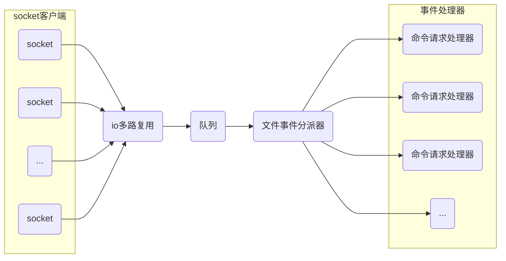
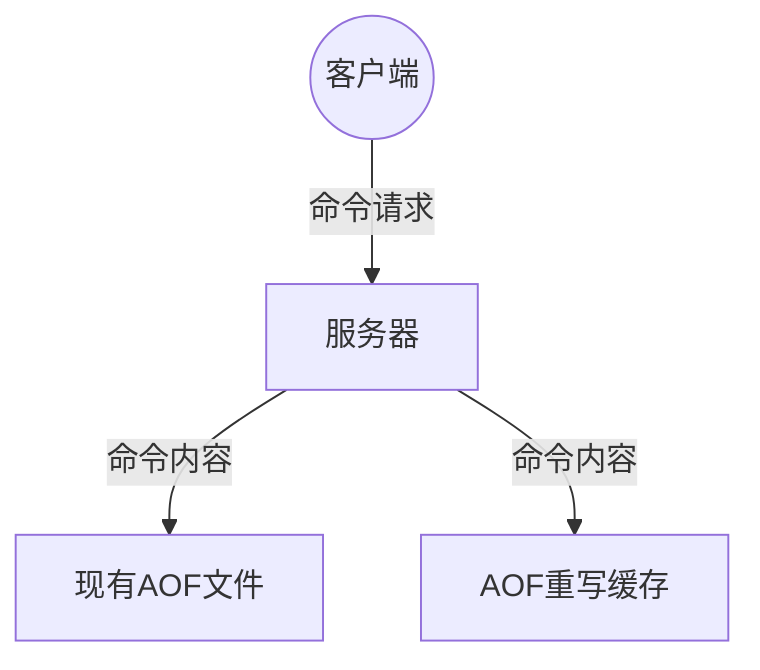
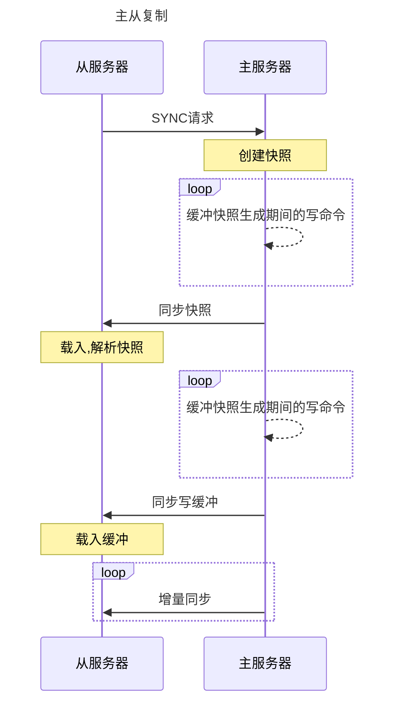
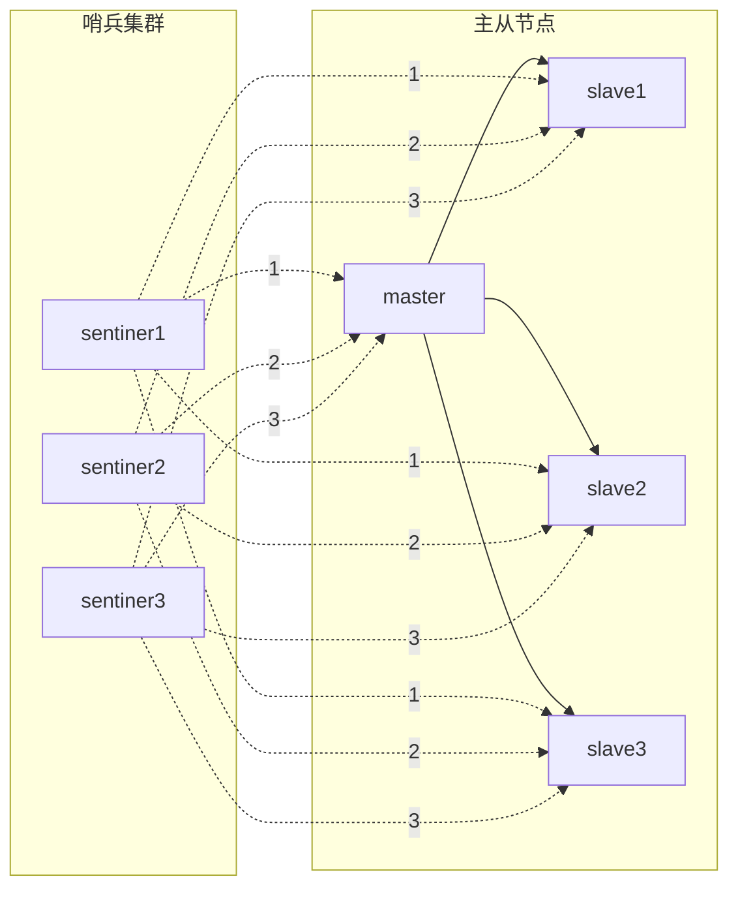
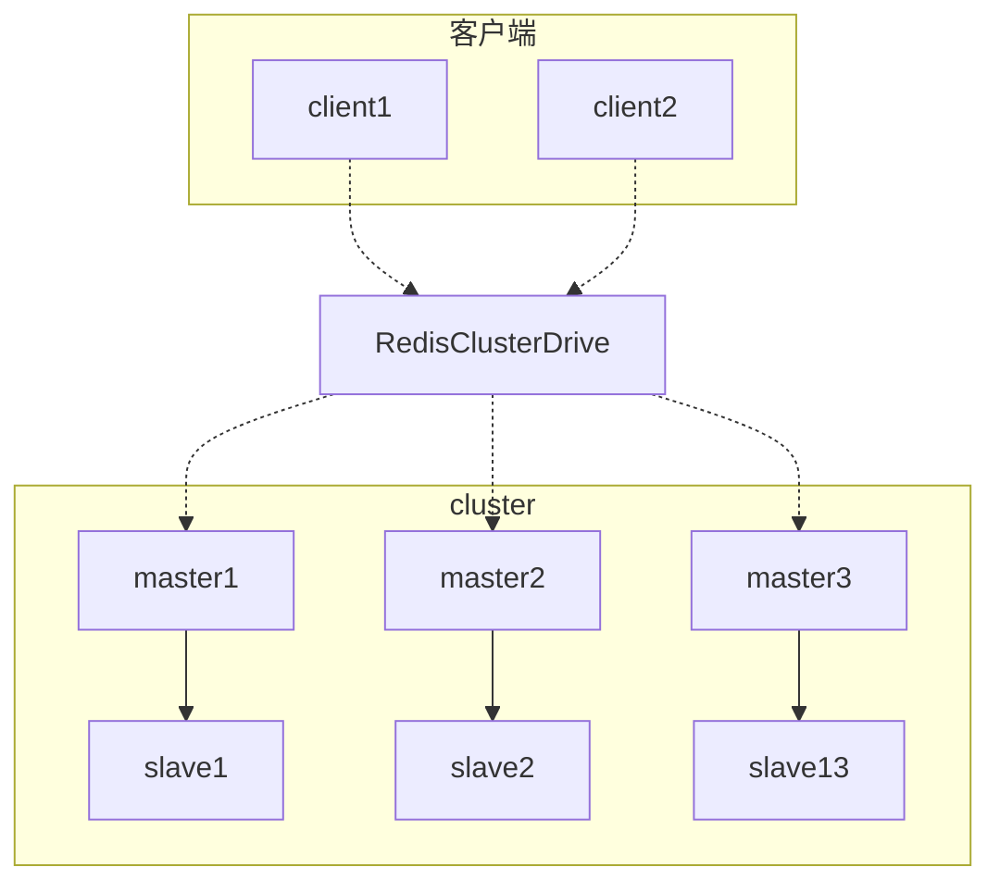

# Redis基础

Redis 是基于内存运行的高性能`K-V`数据库

<!-- more -->

## 1. Redis为什么快

1. 基于内存

2. 单线程,减少上下文的切换,同事保证原子性(redis6+ 可开启多线程)

   1. 开启方式,非必要不开启
   2. 命令执行依旧由主线程负责
   3. 多线程只是负责 `io` 部分

   ```
   io-threads-do-reads yes  #开启IO线程
   io-threads 6    # 设置IO线程数
   ```

3. IO多路复用(epoll, 非阻塞IO)

4. 文件事件处理器(Reactor模式)



`io多路复用`会同时监听多个套接字,当监听的套接字准备好执行`accept`,`read`,`write`,`close`等操作时,就会产生相应的文件事件,`io多路复用`程序会将所有产生事件的套接字都压入一个队列,然后有序的每次仅一个套接字的方式传递给`文件事件分派器`,`文件事件分派器`接收到套接字后会根据套接字产生的事件类型调用对应的时间处理器.

## 2. Redis数据基础数据类型

- string:  一个键对应一个值 (set k v), 内部维护的是一个动态字符串 SDS (Simple Dyamic String)
- set: 是string字符串类型的无序集合,也不可重复(sadd key member)
- zset: 与set类似,但是会关联一个double类型分数用来排序 (zadd key score member)
- hash: 类似java的map,键值对集合,适合存储对象,可针对某一个属性进行修改
- list: 列表,双向链表,可用来实现队列和栈的效果

## 3. 场景分析

根据不通的场景选择合适的数据类型

### 3.1 string应用场景

> 当字符串长度小于1MB, 每次扩容加倍.  大于1MB是,每次扩容1MB

- 常规的 key-value缓存
-  计数(`incr`, `decr`, `incrby`, `decrby`), 阅读量,粉丝数等等

### 3.2 set应用场景

> set 类似于 list, 但是会重拍顺序,并且保证内部元素是不重复的

- 做集合的`交集`,`并集`,`差集`操作, 张三的好友列表放在 `key1`, 李四好友 `key2`, `sinterstore key3 key1 key2`, 则key3为两人的共同好友
- 抽奖功能,首页随机展示广告. `spop`, 将所有人的编号放在set中,通过 spop 随机取出一个元素
- 并集统计. 公共活动A参加的人放在集合 key1, 参加活动B的放在key2, 获取所有参加了活的人. `sumionstore key3 key1 key2`, key3则是参加了活动的所有人

### 3.3 zset应用场景

> 与set相比,多了一个 `score` 权重属性,可按照 `score` 排序

- 排行榜: 考试成绩排名, 直播在线人数排行,礼物排行榜等等

### 3.4 hash应用场景

> 内部是一个 field <-> value 的映射

- 存储人员或者商品的信息:  通过 `hset` 修改某一个属性,而不用全部拿出来
- 购物车: key用户, field商品ID, value 数量
- 存储一些实时统计信息. 终端设备的电量,里程,存储量等各种统计信息,分别在不同的协议上报上来,可通过 `hset` 修改对应的值,并通过 `hgetall` 将信息全部拿出来

### 3.5 list应用场景

> 双向链表

- 队列, A服务通过 `rpush`尾部压入数据, B服务通过 `lpop`从头部拿数据
- 下拉分页的效果:  `lrange`

## 4. Redis持久化方案

redis是内存数据库,宕机后数据会消失,因此需要将内存的数据持久化到磁盘,启动时恢复数据, redis有两种持久化方案,分别是 `RDB` 和 `AOF`.

### 4.1 RDB(Redis DataBase)

默认的存储方式, RDB是通过快照的方式完成的,它保存的是某一时刻的数据信息.

```nginx
save "" #关闭RDB功能

save 3600 1 #1小时内有一次变更则进行快照
save 300 10 #300秒内有10次变更则进行快照
save 60 10000  #1分钟内有1万次变更进行快照 
```

可手动触发, 执行`save`阻塞备份或者 `bgsave`后台备份

```mermaid
graph TB 

bgsave-->父进程
A{是否有其他子进程在处理持久化}
父进程-->A
A--是-->直接返回,不出来
A--否-->B(fork子进程,阻塞)
B-->输出Backgroud_saving_started,并不在阻塞,响应其他命令
B..->子进程
子进程-->C[[生成RDB文件,并替换原有的RDB文件]]
子进程--信号通知父进程生成完毕-->父进程
```

#### 优点

- RDB是二进制的快照,占用空间小,方便传输(slave)
- 使用子进程处理持久化操作,提高redis性能
- RDB格式回复快 

#### 缺点

- 不能保证数据完整性,丢失快照后的数据
- 主进程数据量大的时候, fork子进程时阻塞时间会比较久

### 4.2 AOF(append only file)

默认情况下不开启, 开启后redis会将所有的写入命令写入到aof文件中,记录一个过程,恢复时,按照顺序执行即可

```nginx
appendonly yes # 开启aof
dir . #存储aof问价的位置
appendfilename  appendonly.aof  # 文件名

# aof重写
auto-aof-rewrite-percentage 100   #当前文件大小超过上次AOF文件大小(启动时aof文件大小)百分比的时候重写
auto-aof-rewrite-min-size 64mb  #文件小于64MB的时候,不需要重写

# 手动通过命令 `bgrewriteaof` 进行重写
```

AOF重写后,大大缩小了文件的体积. 只包含了恢复当`前数据的所需的最小命令集合`. 

收到重写信令 -> fork子进程携带主进程的数据副本->开启AOF重写缓存 -> 子进程完成重写 -> AOF重写缓存写入到新的AOF文件 -> 覆盖旧的AOF文件.



#### 优点

1. 一般每隔1秒,后台线程执行一次同步操作,丢失的数据会比较少
2. 可读性强, 例如误操作了 `flushall`, 再没有发生 `rewrite`,可将aof中最后的 `flushall`删除, 恢复数据

#### 缺点

1. 文件大,恢复缓慢
2. redis性能会下降,会频繁的写AOF文件

### 4.3 混合持久化

```nginx
aof-use-db-preamble yes
```

文件的开头是 RBD格式的, 文件后面是 AOF 格式. 发生在 AOF 重写的时候.

## 5. 事务

- multi  开始事务, 命令会放入队列
- exce 执行事务中的所有操作
- discard 取消事务
- watch 监视一个或者多个key, 执行前,key被修改则中断(discard)
- unwatch: 取消watch所有的key的监视

redis的事务是非原子性的,在一次执行ABC命令, 如果B发生类型错误,AC还是会执行的, 但是如果B发生语法错误,那么入队列的时候就发现了,ABC都不会执行. `sets a b` 这种就是语法错误, `lpush a b`, a不是一个list结构时.

完整用法

```nginx
watch balance  # 监听余额

multi  #开启事务
decrby blance 20  #余额减20
incrby blance 40  #余额加40
exce  #提交事务
unwatch   # 取消监听
```

如果在执行事务 `exce`前, balance 被另外的线程修改, 那么exec会返回 '(nil)' 执行失败,事务回滚,整个都不执行.

## 6. Redis高可用

主从模式, 哨兵模式, 集群模式

### 6.1 主从模式

> 1住多从

- 主机具有读写能力,从机读



### 6.2 哨兵模式

主从模式下,当master宕机后,需要手动把从机切换到master, 而哨兵模式会自动选举,将其中一个slave作为新的master.

哨兵自己也可以进行集群,一般为基数个



### 6.3 集群模式(cluster模式)

哨兵模式下, 已经是高可用状态,但是他有一个严重的缺陷,就是所有机器的数据都是一样,极大的浪费内存. Redis 采用的是 `slot` 插槽的方式,将不通的数据存储到不通的机器上,一共 `16383`个插槽.

