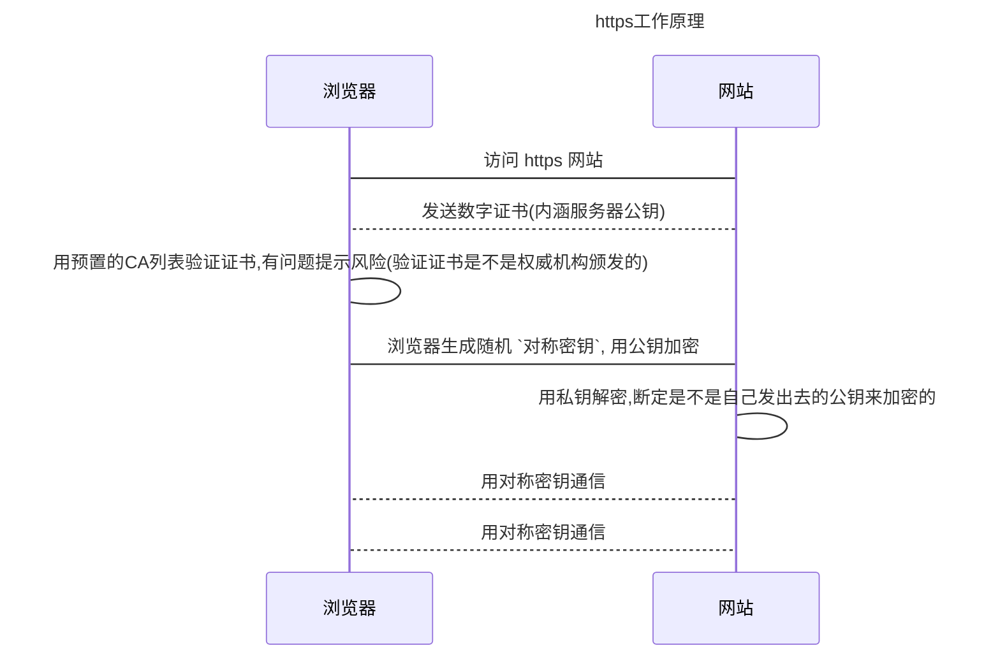

# HTTPS

HTTPS=HTTP over SSL/TLS, 在应用层HTTP与协议层TCP中加了一层  **SSL/TLS** 来保证数据安全性,  默认端口 443

<!-- more -->

## 1. SSL/TLS

- `数据加密` 来往通信的数据都是加密的
- `完整性校验`  加密的通信数据经过消息完整性校验MAC, 防止篡改
- `身份验证` TLS握手过程使用的证书是经过权威CA签名的，进行身份验证，防止身份假冒



## 2. 数字证书主要内容

> 可通过浏览器, 安全一列去随机查看一个证书

- 公钥 public key
- ISSUSER 证书颁发机构
- Subject 证书持有者
- 证书有效期
- 签名算法(hash算法)
- 指纹  证书的唯一编号,用来保证证书的完整性.CA机构用 `指纹算法`计算得到的hash值
- 指纹算法

## 3. 数字签名

CA机构将证书的指纹和指纹算法通过自己的私钥加密得到的就是证书的签名

## 4. 自己制作证书

> 1. 准备工具 openssl
> 2. 证书相关的文件: PKCS标准

- .key  私钥文件, 通常采用 rsa 算法,自己保存, 不用给 CA机构
- .csr   证书签名请求文件, 包含了公钥信息, 用自己的私钥去生成
- .crt   CA认证后的证书文件
- .crl    证书吊销列表
- .pem  用于导出,导入证书.(.crt与.key合体), windows下是 .pfx 格式.

将会生成三个最重要的文件 ` ca_dxp.crt` , `dxp.crt` 和 `dxp.key`

### 4.1 生成自签根证书

> 整个过程本人是在windows 环境下操作的

#### 4.1.1 主备工作

1. 安装openssl, 如果安装了git会自动安装的
2. 配置环境变量 `openssl_conf` 指向 ssl 下的  openssl.cnf, 不想配置的可以直接在windows 命令行用  `set openssl_conf=xxxx\opensll.cnf` 也行

#### 4.1.2 开始生成

生成CA私钥(.key)  ->  生成证书(.csr)   ->  自签名得到得根证书 (.crt)

```cmd
# 生成 CA 私钥, 不用密码,强度2048
openssl genrsa -out ca_dxp.key 2048

# CA CSR
openssl req -new -key ca_dxp.key -out ca_dxp.csr

# 根证书, 最终浏览器中需要将这个导入到根证书
openssl x509 -req -days 3650 -in ca_dxp.csr -signkey ca_dxp.key -out ca_dxp.crt
```

根证书是自己给自己签名(自己就是那个权威机构)

### 4.2 根证书签名生成用户证书

#### 4.2.1 主备工作

1. 环境同 4.1.1
2. 需要在生成证书的文件夹下新增目录(执行 `openssl ca` 时发现的错误)
   1. 
   2. demoCA/newcerts
   3. 在 `demoCA` 下新建空白文件 `index.txt`
   4. 在 `demoCA` 下新建空白文件 `serial`, 输入 `01` 和一个`换行符` 即可
   5. 在生成 csr 时,填入的信息需要和 ca.csr一致, 不然生成 `openssl ca` 会失败,并给出不同点的提示

#### 4.2.2开始生成

生成私钥（*.key*）-->生成证书请求（*.csr*）-->用CA根证书签名得到证书（*.crt*)

```cmd
# 私钥, 密码 123456
openssl genrsa -des3 -passout pass:123456 -out dxp.key 1024 

# csr
openssl req -new -key dxp.key -passin pass:123456 -out dxp.csr

# 证书
openssl ca -in dxp.csr -out dxp.crt -cert ca_dxp.crt -keyfile ca_dxp.key

# 导出证书, 填入自己需要的密码,可以不填, 我填的 111222
openssl pkcs12 -export -inkey dxp.key -passin pass:123456 -in dxp.crt -out dxp_pkcs12.pfx
```

证书需要用要CA的 csr 和 key

## 5. 配置证书

> 需要先将 `ca_dxp.crt` 导入到浏览器的根证书中心, 这里授权的时10年

### 5.1 springboot 中使用

将 `dxp_pkcs12.pfx` 复制到自己 `resources` 下,  在配置文件添加上即可

```properties
# ssl
server.ssl.key-store=classpath:dxp_pkcs12.pfx
server.ssl.key-store-password=111222
server.ssl.key-store-type=pkcs12
```

### 5.2 nginx 中使用

nginx 中不允许使用 带有密码的私钥,所以需要解密 `dxp.key`

```shell
openssl rsa -in dxp.key -passin pass:123456 -out dxp_nopass.key
```

nginx.conf 配置如下

```nginx
 server {
        listen       1443 ssl;
        server_name  localhost;

		# conf 下的可以用证书文件相对路径
        ssl_certificate      ssl/dxp.crt;
	    # conf 下的可以用证书文件相对路径
        ssl_certificate_key  ssl/dxp_nopass.key;

        ssl_session_cache    shared:SSL:10m;
        ssl_session_timeout  15m;

        ssl_ciphers  HIGH:!aNULL:!MD5;
        ssl_prefer_server_ciphers  on;

        location / {
            root   html;
            index  index.html index.htm;
        }
    }
```

### 5.3 node_express中使用

和nginx差不多,需要用 `dxp.key` 和 `dxp.crt`, 不同的是,可以配置密码

```javascript
var app = require('express')();
var fs = require('fs');
var path = require('path');
var https = require('https');

let keyPath = path.resolve(__dirname, 'dxp.key');
let crtPath = path.resolve(__dirname, 'dxp.crt');

var privateKey  = fs.readFileSync(keyPath, 'utf8');
var certificate = fs.readFileSync(crtPath, 'utf8');

var httpsServer = https.createServer( {key: privateKey, cert: certificate, passphrase: "123456"}, app);

var SSLPORT = 18081;

httpsServer.listen(SSLPORT, function() {
    console.log('HTTPS Server is running on: https://localhost:%s', SSLPORT);
});

// Welcome
app.get('/', function(req, res) {
    res.status(200).send('Welcome to Safety Land!');
});
```